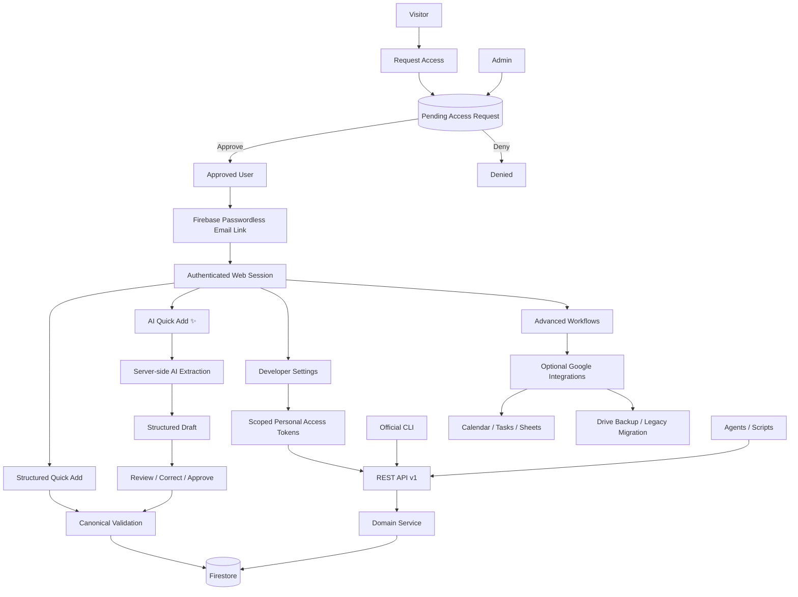

# Domain Expansion — Context

## Discovery Status

- Grill-to-Build discovery round: 2 complete
- Product questions answered: 8
- Living model format: Markdown/Mermaid (workflow default because no explicit preference was supplied)
- Specification status: not yet created; discovery is still active
- Tickets status: not yet created

## Product Summary

Domain Expansion is a fast, human-first domain portfolio tracker with a richer canonical data model underneath a deliberately simple interface.

The current implementation base is `devin-thomas/domain-expansion-ai-studio`, a React/TypeScript/Vite web application deployed on Vercel. The original Flutter repository, `devin-thomas/domain-expansion`, is a reference/donor implementation for richer domain semantics and advanced workflows, not the implementation base to continue.

The public production identity should use:

- App URL: `domains.devthomas.site`
- Passwordless authentication sender target: `Domain Expansion <auth@devthomas.site>`

## Product Principle

### A small number of impactful items

Every primary screen should show a small number of high-impact actions, values, or decisions.

The application may know substantially more about a domain than it asks a human to enter during routine capture.

Advanced capability must not make quick capture slower, noisier, or cognitively heavier.

The original Flutter product model is valuable as a source of richer semantics, but its richer fields and workflows must be gated behind deliberate advanced surfaces rather than reintroduced into the default flow.

## Primary Use

The normal user should be able to record a domain quickly while doing something else, with minimal interruption.

The two primary capture modes are:

1. Structured Quick Add
2. AI Quick Add

Both modes produce the same canonical domain record and use the same validation rules.

## Structured Quick Add

The normal quick-add surface contains only:

- Domain
- Registrar
- Renewal date
- Renewal cost + currency
- Renewal intention: Renew / Let expire

Ordinary defaults cover concepts such as Active and Owned unless the user chooses to change them.

A `More details` action exposes advanced fields without expanding the default form.

## AI Quick Add

AI Quick Add is a separate quick-add mode marked with an AI/sparkles visual treatment.

Example input:

> add foo.dev, Porkbun, $12 renewal, expires March 4

The AI path must follow this sequence:

```text
Natural-language input
        ↓
Server-side extraction
        ↓
Structured domain draft
        ↓
Validation + uncertainty display
        ↓
User review/correction
        ↓
Explicit approval
        ↓
Canonical Firestore save
```

AI output is proposed data, never canonical state by itself.

Unknown or ambiguous values remain unknown or are surfaced for review rather than silently invented.

The feature should reuse the proven Wayfarer interaction pattern: extraction creates a structured draft, and only an explicitly approved draft is promoted into canonical state.

The AI provider must sit behind a replaceable server-side adapter. Provider credentials must never ship in the browser bundle.

## Advanced Domain Data

The richer original Flutter domain model should be restored where useful, while remaining subordinate to the simple UI.

Advanced fields/workflows may include:

- DNS provider
- Registration date
- Registration cost
- Separate billing date and expiration date
- Ownership relationship
- Lifecycle state
- Auto-renew state
- Notes
- Reminder overrides
- Archive state
- Import/export and backup workflows

The exact advanced-field set remains subject to specification, but the architecture should not collapse these concepts merely because Quick Add does not show them.

## Accounts and Access

Domain Expansion is not an open-signup product.

Roles:

### Applicant

A person who requests access.

An applicant has no access to Domain Expansion user data.

### Approved User

A user whose email has been approved by the administrator.

Approved users may authenticate with passwordless email and access only their authorized data.

### Administrator

The product owner/administrator who can review access requests and approve or deny them.

Initial access workflow:

```text
Visitor
  ↓
Request access
  ↓
Pending access request
  ↓
Admin review
  ├── Deny → no account access
  └── Approve
         ↓
      First passwordless sign-in link is sent
         ↓
      Approved user
```

Public request responses should not disclose sensitive account-state information unnecessarily.

Authentication is separate from authorization. A Firebase Auth identity alone must not grant access to protected Firestore data unless the user is approved.

## Authentication

Use Firebase Authentication with passwordless email-link sign-in.

Start with Firebase's own email delivery.

A more heavily branded email delivery path through an external provider such as Resend is deferred unless Firebase's customization proves insufficient.

Authentication and Google integrations are separate concerns. Signing into Domain Expansion must not require Google OAuth.

## Persistence

Firestore is the canonical database.

The former Google Drive `appDataFolder` live-sync architecture is superseded as the primary persistence layer.

Data should behave like normal authenticated cloud application data rather than a browser-local catalog whose cloud persistence depends on an ephemeral Google Drive OAuth token.

## Legacy Google Drive Migration

Existing AI Studio data stored in Google Drive should have a one-time migration path:

1. User authenticates to the upgraded Domain Expansion.
2. User deliberately connects/authorizes Google Drive for migration.
3. Domain Expansion finds legacy `domain-expansion.json`.
4. The app shows a migration/import preview.
5. The user confirms.
6. Data is normalized into the new canonical model and written to Firestore.
7. Firestore becomes authoritative.

After migration, Google Drive may remain available as an advanced backup/restore destination, but not as a second live database.

## Google Integrations

Google Calendar, Tasks, Sheets, and Drive are optional integrations.

They should request Google authorization only when the user invokes a feature that needs the corresponding scope.

Domain Expansion identity must not depend on those integrations.

## Automation

Automation is a first-class product surface.

The application should expose a stable REST API rather than requiring agents or scripts to automate the browser UI or access Firestore directly.

Initial automation contract:

- REST API: required
- Official CLI: required as a thin client over the REST API
- Outbound webhooks: deferred until a concrete consumer/event workflow requires them

Potential API surface:

```text
/api/v1/domains
/api/v1/domains/:id
/api/v1/import
/api/v1/export
```

Exact routes remain subject to specification.

### API Authentication

Human browser sessions use Firebase Auth.

Automation uses named, revocable personal access tokens managed from an advanced Developer settings surface.

Expected token characteristics:

- named
- revocable
- scoped
- secret shown only when appropriate
- stored as a non-recoverable verifier/hash rather than plaintext when feasible

Initial conceptual scopes:

- `domains:read`
- `domains:write`

Final scope granularity remains open.

The CLI must use the same public API rather than becoming a second Firestore client.

## Current Implementation Base

`devin-thomas/domain-expansion-ai-studio`

Current stack:

- React
- TypeScript
- Vite
- Tailwind CSS
- Firebase client SDK
- Vercel deployment
- Google OAuth integrations
- Google Drive `appDataFolder` persistence
- Google Calendar / Tasks / Sheets helpers
- import/export utilities
- responsive product showcase route

Known cleanup items:

- package name is still `react-example`
- Firebase project configuration still reflects the AI Studio-generated project identity
- Google authentication and Google Drive authorization are currently coupled
- current persistence assumes localStorage plus Drive synchronization
- current domain type is simpler than the desired canonical model

## Original Flutter Reference

`devin-thomas/domain-expansion`

Useful donor concepts include:

- separate billing and expiration dates
- separate registration and renewal costs
- DNS provider
- archive semantics
- explicit reminder semantics
- richer import/export behavior
- richer domain lifecycle vocabulary

The Flutter application itself is not the forward implementation base.

## Living System Model



## Deferred but Preserved

See `Ideas.md`.

## Open Questions

Discovery remains open around:

- AI save/review behavior details
- initial Gemini model/fallback policy
- personal access token scope granularity and automation safety
- access-request/admin notification behavior
- exact multi-user Firestore ownership/isolation rules
- canonical advanced-domain schema and migration mapping
