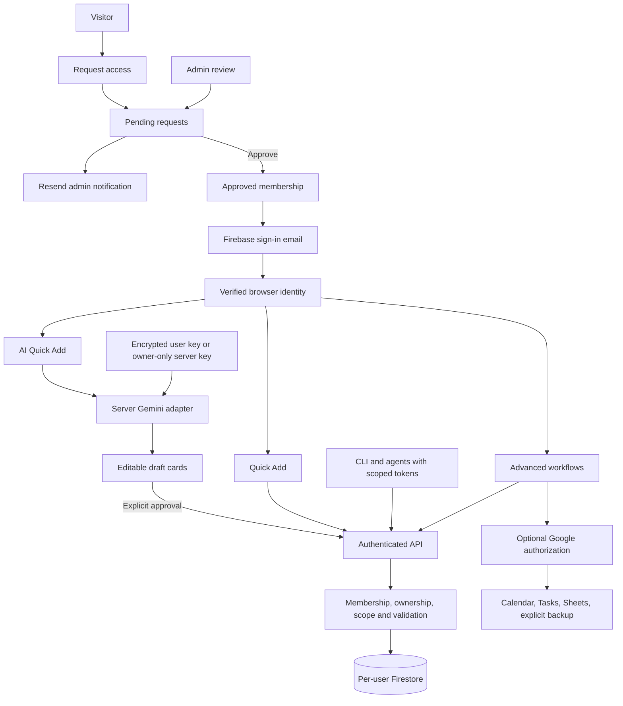

# Domain Expansion — Context

## Status and authority

Discovery is complete: **5 rounds, 20 product questions resolved**. The final user instruction approves separate API delete permission, strict per-user storage, and archive-first operation, and explicitly removes legacy Google Drive migration from this build. The requested endpoint is the documentation/build pack, not implementation or infrastructure changes.

Read [SPEC.md](SPEC.md) for the implementation contract and [tickets/README.md](tickets/README.md) for the ordered work. All implementation tickets initially remain Not started. [ADR.md](ADR.md) preserves decision history, including the superseded migration decision. [Ideas.md](Ideas.md) is non-binding deferred work.

Authority: current explicit user decision → Context → ADR rationale → SPEC → ticket acceptance criteria → implementation. Do not mistake the existing prototype for completed target behavior.

## Product and implementation base

Domain Expansion is a fast, human-first website domain tracker, with richer data available when a task actually needs it. Continue in `devin-thomas/domain-expansion-ai-studio`, preserving its React/TypeScript/Vite interface, responsive work, and product showcase. The original Flutter `devin-thomas/domain-expansion` is a reference for domain semantics, not a second implementation to maintain or merge.

Production identity: `domains.devthomas.site`. Authentication sender target: `Domain Expansion <auth@devthomas.site>`, subject to verifying Firebase's template and DNS configuration. This documentation does not assert that either has been provisioned.

### Governing principle: a small number of impactful items

A richer schema must not become a larger default form. Normal use is for someone jotting down information while doing something else. Primary screens emphasize one task and a few useful values; advanced information is deliberately opened, not displayed everywhere. No redesign that undoes the AI Studio version's simplicity is authorized.

## Capture and presentation

There are exactly two capture modes:

1. **Quick Add:** Domain, Registrar, Renewal date, Renewal cost + currency, and Renew / Let expire. Active, Owned, and the default currency are ordinary defaults. Unknown costs stay unknown. `More details` opens advanced fields without making them prerequisites for ordinary capture.
2. **✨ AI Quick Add:** a compact command/chat input, followed by small editable review cards and an explicit Add action. It accepts one or many domain descriptions. It never auto-saves, even when every value looks certain. Valid selected drafts can be approved together; ambiguous or invalid drafts remain available for correction.

An AI preview should feel like `foo.dev · Porkbun · Mar 4, 2027 · $12 USD · Renew`, not another application inside the application. An inferred year must be visible as a proposal, not silently asserted. Only unresolved facts require extra work. Successful approval returns to the useful application state.

Dashboard priority: next expected payment, next-12-month expected cost separated by currency, and a compact upcoming list. Search and ordinary edit/archive remain easy to reach. Advanced record details, reports, imports/exports, integration connections, AI key setup, and developer tokens live behind deliberate detail/settings surfaces. Admin navigation appears only for the appropriate role. The public showcase contains synthetic product evidence, never private user records.

## Ubiquitous language

| Term | Meaning and source of truth |
|---|---|
| Domain record | A user-entered portfolio item; not proof of domain ownership and not a registrar control panel. |
| Ownership | Stored relationship: `owned` or `managed`; independent of application account ownership. |
| Lifecycle | Stored `active`, `inactive`, or `transferred`. |
| Renewal intention | Stored `renew` or `let_expire`; reversible and separate from actual registrar auto-renew. |
| Auto-renew | User-recorded registrar setting; `true`, `false`, or unknown. The application does not change the registrar. |
| Billing / expiration | Separate date-only facts. Effective billing falls back to expiration and vice versa. |
| Quick Add renewal date | Simple input mapped to expiration date, with billing left unset; fallback supplies the initial payment date. |
| Registration / renewal cost | Separate optional integer minor-unit amounts in the record's currency. Unknown is not zero. |
| Archive | Reversible exclusion from ordinary active views; preserves the record. |
| Permanent delete | Explicit irreversible record removal, separately authorized. |
| AI draft | Untrusted proposed data, not a saved domain. |
| Approved member | Identity permitted to use the application; authentication alone is insufficient. |
| Administrator | Application access-management role, not permission to read other portfolios. |
| Owner exception | One explicitly configured owner UID may use the server's Gemini credential; it is not inherited by all admins. |
| Personal access token | Scoped, revocable automation credential, not a Firebase browser session or Gemini key. |

Stored advanced data includes registrar, DNS provider, ownership, lifecycle, renewal intention, auto-renew, registration/billing/expiration dates, registration/renewal costs, currency, notes, archive state, reminder configuration, and created/updated metadata. Effective dates, urgency, spending totals, and upcoming status are derived. External Google event/task references are integration metadata, not authority over the domain record.

## Accounts, approval, and privacy

Visitors can Sign in or Request access. A request creates a pending administrative item, not authorized product access. The administrator gets both the queue/badge and an email notification. Approve grants eligibility and initiates the first Firebase sign-in email; Deny does not grant access. Failed email delivery must not lose a request or silently undo an approval.

Every authenticated request checks current membership. Directly obtaining a Firebase identity does not bypass approval. Suspending membership disables both browser and API access without deleting the portfolio. Bootstrap the owner through trusted deployment configuration, never a public first-user-is-admin rule.

Every user's records are private to that account in the product. The admin interface manages requests and membership only; it contains no cross-user portfolio browsing, impersonation, or key-retrieval feature. This is application-level isolation, **not end-to-end encryption**: privileged cloud operators and backend service credentials remain within the infrastructure trust boundary. Privacy text must say this honestly.

## Authentication and mail

Firebase Authentication handles passwordless email links and initially sends those emails itself. Resend sends administrator-facing access-request notifications. Resend is not the default authentication sender in this build. Google OAuth is optional integration authorization, separate from Domain Expansion identity.

The URL, authorized domains, email action callbacks, sender verification, abuse limits, and actual delivery need release evidence. Firebase's documented Spark email-link quota is small; review billing/quota configuration before inviting other users. Do not silently enable paid billing or switch providers as part of implementing the pack.

## Persistence and service boundary

Firestore is authoritative. Ordinary reads and writes go through a common server API/domain service, whether the caller is the browser or CLI. User data is nested below `users/{uid}`; the UID comes from the verified caller, never an untrusted request field.

Conceptual layout:

```text
users/{uid}/domains/{domainId}
users/{uid}/domainNames/{normalizedNameHash}
users/{uid}/settings/app
users/{uid}/apiTokens/{tokenId}
users/{uid}/privateCredentials/gemini
members/{uid}
accessRequests/{requestId}
server-only approval, notification, rate-limit, and idempotency records
```

Client Firestore access is denied in the initial API-first implementation. Firebase Admin bypasses client security rules, so the server must enforce ownership, membership, and scopes independently. Secrets and access-control records are not ordinary user-readable documents.

### No legacy Drive migration

The owner reports no known Drive backup requiring migration and explicitly excludes that work. Do not build a legacy discovery scan, first-login migration wizard, reconciliation system, or `appDataFolder` migration ticket. Start with an empty Firestore portfolio for a new approved account. Remove old live-sync behavior without attempting to delete external files or silently adopt legacy browser data.

Ordinary explicit file import/export and optional user-initiated Google Drive backup remain advanced capabilities. They are not a reason to reintroduce historical migration machinery. Firestore schema evolution from this release onward is distinct from the excluded legacy migration.

## AI credentials and processing

Use a replaceable server adapter, initially Gemini `gemini-3.5-flash-lite` with `gemini-3.8-flash` as bounded transient-failure fallback. Both calls use the same caller-selected credential. Verify model access with real test calls during implementation; published availability is not proof that a particular key has access.

Approved non-owner users deliberately configure their own Gemini key and acknowledge sending their submitted text to Google under that key's applicable terms. BYOK does not itself guarantee that Google will not use the data to improve products. Manual capture remains fully usable without AI.

Persist user keys encrypted server-side. Firestore stores ciphertext and non-secret metadata; the encryption key is deployment-managed and never exposed to client code. Keys can be replaced or removed and are never returned after submission. Rotation, authenticated encryption, redacted logging, and fail-closed behavior are required.

The explicitly configured owner UID may instead use a private server Gemini key, reflecting the owner's accepted data-handling preference. Never fall back to this key for another user, including another administrator.

AI receives only the submitted text and minimal date/currency context, not the entire portfolio. Model output is validated data, not executable instructions. No tool execution, registrar mutation, general assistant scope, or writes before human approval. Input and output are not retained as chat history in this release.

## Automation and destructive behavior

Build `/api/v1` plus an official CLI that consumes it. Document the same canonical data contract used by the UI. Tokens are named, expiring, revocable, and stored as non-recoverable verifiers; plaintext is shown only on creation.

Scopes are independent:

- `domains:read`: retrieve/search/export the caller's domains.
- `domains:write`: create/edit/import/archive/unarchive; never permanent deletion.
- `domains:delete`: explicit permanent removal.

Tokens do not authorize admin actions, token minting, credential access, or AI-provider spending. Trusted automated create/update requests may save immediately; the no-auto-save rule concerns AI Quick Add proposals. Archive is the normal reversible operation. CLI permanent deletion requires a deliberate command and interactive confirmation, or an explicit unattended confirmation flag. The web UI places it in the advanced danger surface.

## Integrations and portability

Keep Google Calendar, Tasks, Sheets, and explicit Drive backup optional and advanced. Request only relevant permissions when invoked; denied or expired Google consent cannot stop ordinary saves. Connecting Google must not replace the Firebase UID. Core domain data does not depend on external event creation succeeding.

Preserve ordinary file-based portability through the richer canonical schema, with honest format capabilities and no credential export. Reminder configuration and in-app urgency are required; optional Calendar/Tasks delivery must be explicit. Native Flutter notification parity and app-sent renewal email are not implied by restoring reminder fields.

## Living model and workflow preferences

Format: Markdown/Mermaid, inherited workflow default. No external canvas or public sharing is required.



## Closed discovery and remaining execution checks

No product questions remain open for this pack. Token lifetimes, batch sizes, route naming, and defensive limits in SPEC are explicit adjustable implementation defaults, not extra feature commitments.

Outstanding execution inputs are owner/admin destination configuration, Firebase project and credentials, sender/DNS permissions, API and encryption secrets, and real-device/provider verification. They block particular live acceptance checks, not writing or implementing the independent code. Never commit real credentials, invent passing tests, or label unprovisioned infrastructure as live.
